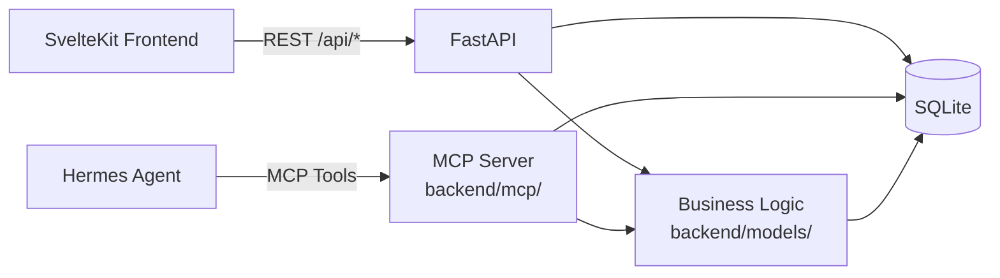

# swissknife-productivity — Bouwopdracht

> **Projectnaam:** swissknife-productivity  
> **Versie:** 0.1  
> **Status:** `concept`  
> **Laatste update:** 2026-08-09  
> **Aangemaakt door:** TITO (projectmanager: Chad / Hermes Agent)  

---

## 1. Samenvatting

Een lichtgewicht, zelf-gehoste productiviteitsapplicatie met samengebundelde functionaliteit: Kanban-bord, notities, dagelijkse taken, pomodoro-timer, wiki en code snippets. De applicatie is bereikbaar via een responsive webinterface (SvelteKit → REST API) **en** via een **MCP-server** voor Hermes Agent. **Hermes Agent is de primaire co-pilot** — hij krijgt gestructureerde tools via MCP in plaats van rauwe curl-calls, en kan alle modules volledig aansturen: aanmaken, editen, verwijderen van notities, kanban-kaarten, taken, pomodoro-sessies, snippets en wiki-pagina's.

---

## 2. Doel & Use Cases

- **Doel:** Persoonlijke productiviteitstool — alles-in-één voor dagelijks gebruik.
- **Primary user:** Eén gebruiker (TITO).
- **Use cases:**
  1. Dagelijkse notities, activiteiten en taken bijhouden.
  2. Projecten beheren via een Kanban-bord.
  3. Kennis opslaan in een wiki.
  4. Code snippets bewaren en terugvinden.
  5. Focus-werk doen met een pomodoro-timer.
  6. **Hermes Agent stuurt alles aan via MCP** — gestructureerde tools (JSON Schema) voor aanmaken, lezen, wijzigen en verwijderen in elke module, zonder curl of URL-kennis.

---

## 3. Functionaliteit

### 3.1 Must-have (MVP)

- [ ] **Kanban-bord** — kaarten aanmaken, bewerken, verplaatsen (todo → doing → done)
- [ ] **Notities** — aanmaken, bewerken, verwijderen
- [ ] **Dagelijkse taken** — takenlijst per dag met afvink-functionaliteit
- [ ] **Pomodoro-timer** — starten, stoppen, resetten; instelbare focus/pauze-tijden
- [ ] **Wiki** — markdown-pagina's aanmaken, bewerken en doorzoeken
- [ ] **Code snippets** — code opslaan met syntax highlighting en taallabel
- [ ] **REST API** — endpoints voor SvelteKit frontend (`/api/notes`, `/api/kanban`, `/api/tasks`, `/api/pomodoro`, `/api/snippets`, `/api/wiki`)
  - Volledige CRUD per module (GET, POST, PUT, DELETE)
  - JSON-responses, geen aparte auth-laag voor MVP (single-user)
- [ ] **MCP Server** — Hermes Agent krijgt tools met JSON Schema i.p.v. rauwe REST-calls
  - Één Python MCP-server (`backend/mcp/`) die dezelfde database en modellen gebruikt als de REST API
  - Tools per module: `mcp_swissknife_notes_create`, `mcp_swissknife_tasks_edit`, etc.
  - Hermes config: `mcp_servers.swissknife.command: "uv run python -m backend.mcp.server"`
  - Geen aparte HTTP-calls nodig — Hermes roept tools direct aan
  - Herbruikt business-logic uit de backend; geen dubbele code
- [ ] **Responsive UI** — werkt op desktop, mobiel en tablet
- [ ] **Docker Compose** — één `docker-compose up` en de app draait

## 3.2 Nice-to-have (v0.3)

- [ ] **Pomodoro per taak** — start een pomodoro op een taak/kanban-kaart/notitie, timer zichtbaar in header, rapportage van bestede tijd per item
- [ ] **Universele tags** — tags toepassen op wiki, taken, notes en kanban. Eén `tags`-tabel + polymorfe `taggings`-tabel. Filteren en zoeken op tags overal.
- [ ] **Globale zoekbalk** — één zoekbalk in de header die door alle modules zoekt (notes, tasks, kanban, wiki, snippets). Resultaten per categorie gegroepeerd.
- [ ] **Themes** — 5-10 kleurthema's: donker, licht, grijs, antraciet, groen, blauw, paars, sepia, high-contrast, OLED. Keuze in de sidebar of header.
- [ ] **Kalender** — overzicht van deadlines uit taken met `due_date`. Maand/week/dag weergave. Klik op datum voor taken op die dag.
- [ ] **Clean compact design** — alles dichter op elkaar: kleinere padding, compactere cards, meer informatie per scherm. Optionele 'compact' toggle in de header.

## 3.3 Toekomst

(Wordt later ingevuld.)

---

## 4. Tech Stack

- **Runtime:** Python + FastAPI (single container — serveert zowel API als statische frontend)
- **Frontend:** SvelteKit (SSG — static site generation, pre-built naar statische HTML/JS/CSS)
- **Database:** SQLite (lokaal, bestand in gemapete volume, geen aparte server)
- **APIs / externe diensten:**
  - REST API voor SvelteKit frontend (`/api/*`)
  - Statische bestanden rechtstreeks vanuit FastAPI (`/` → frontend build)
  - **MCP Server voor Hermes Agent** (tools i.p.v. rauwe HTTP)
  - Geen externe API-afhankelijkheden
- **Containerisatie:** Docker + docker-compose (één service, één container)
- **Image registry:** GitHub Container Registry (GHCR) — `ghcr.io/jayvenco/sk-productivity:*`
- **CI/CD:** GitHub Actions — bouwt en pusht images naar GHCR op basis van branchnaam
- **Git workflow:** GitFlow-achtig — `staging` (werkbranch) + `main` (beschermde productiebranch)
- **Versiebeheer:** Publieke git repository op GitHub

---

## 5. Structuur (project tree)

```
skp/
├── app/                            # Alles in één container
│   ├── __init__.py
│   ├── main.py                    # FastAPI entry point (poort 4442)
│   ├── database.py                # SQLite setup & connection
│   ├── models/                    # SQLAlchemy database modellen
│   │   ├── __init__.py
│   │   ├── notes.py
│   │   ├── tasks.py
│   │   ├── kanban.py
│   │   ├── pomodoro.py
│   │   ├── wiki.py
│   │   └── snippets.py
│   ├── routes/                    # REST API endpoints
│   │   ├── __init__.py
│   │   ├── notes.py
│   │   ├── tasks.py
│   │   ├── kanban.py
│   │   ├── pomodoro.py
│   │   ├── wiki.py
│   │   └── snippets.py
│   └── mcp_tools/                 # MCP Server voor Hermes Agent
│       ├── __init__.py
│       ├── server.py              # MCP entry point (FastMCP)
│       ├── tools_notes.py
│       ├── tools_tasks.py
│       ├── tools_kanban.py
│       ├── tools_pomodoro.py
│       ├── tools_snippets.py
│       └── tools_wiki.py
├── frontend/                      # SvelteKit bron (built naar static/)
│   ├── src/
│   │   ├── app.html
│   │   ├── app.css
│   │   ├── lib/
│   │   │   ├── api.ts             # API client (fetch naar /api/*)
│   │   │   └── components/
│   │   │       └── Sidebar.svelte
│   │   └── routes/
│   │       ├── +layout.svelte
│   │       ├── +page.svelte       # Dashboard / hub
│   │       ├── notes/+page.svelte
│   │       ├── tasks/+page.svelte
│   │       ├── kanban/+page.svelte
│   │       ├── pomodoro/+page.svelte
│   │       ├── wiki/+page.svelte
│   │       └── snippets/+page.svelte
│   ├── package.json
│   ├── svelte.config.js
│   ├── vite.config.ts
│   └── tsconfig.json
├── static/                        # Pre-built SvelteKit output (git-ignored)
├── data/                          # SQLite database (git-ignored, gemapt volume)
├── Dockerfile                     # Multi-stage: build frontend + backend in 1 image
├── docker-compose.yml             # Één service, één container, poort 4442
├── .dockerignore
├── .github/
│   └── workflows/
│       └── docker-publish.yml     # CI/CD: GHCR push op basis van branch
├── .gitignore
├── README.md
├── OPDRACHT.md
└── docs/
    └── API.md                     # API-documentatie (OpenAPI/Swagger)
```

---

## 6. Input / Output

- **Input:** Browser (webinterface op mobiel, tablet en desktop) + Hermes Agent (MCP-tools)
- **Output:** Webinterface (SvelteKit frontend) + JSON-responses via REST API + MCP-tool results

---

## 7. Randvoorwaarden & Constraints

- [x] Draait in **Docker** (self-hosted op Unraid NAS)
- [x] Start met één commando: `docker-compose up`
- [x] Draait op **poort 4442**
- [x] **SQLite** voor data-opslag (lokaal, geen netwerk-db)
- [x] **REST API** — endpoints voor SvelteKit frontend
- [x] **MCP Server** — Hermes Agent krijgt tools via MCP i.p.v. rauwe HTTP
- [x] Gedeelde database en modellen (REST API + MCP server gebruiken zelfde SQLite & code)
- [x] **Responsive UI** — compatible met mobiel, tablet en desktop
- [x] **Publieke git repository** — code staat openbaar op GitHub
- [x] Geen externe API-dependencies
- [x] Lichtgewicht — minimale resource usage (Unraid-friendly)

---

## 8. Acceptatiecriteria

De app is klaar wanneer:

1. [ ] `docker-compose up` start de volledige app (backend + frontend)
2. [ ] Webinterface is bereikbaar op `http://<host>:4442`
3. [ ] Kanban-bord werkt: kaarten aanmaken, bewerken, verplaatsen
4. [ ] Notities aanmaken, bewerken en verwijderen
5. [ ] Dagelijkse taken bijhouden en afvinken
6. [ ] Pomodoro-timer starten, stoppen en resetten
7. [ ] Wiki-pagina's aanmaken, bewerken en doorzoeken (markdown)
8. [ ] Code snippets opslaan met syntax highlighting
9. [ ] Responsive UI: werkt op mobiel (touch), tablet en desktop
10. [ ] **MCP Server** is actief — Hermes Agent kan verbinden en tools ontdekken (`hermes mcp test swissknife`)
11. [ ] Hermes Agent kan via MCP-tools in elke module **aanmaken, editen, uitlezen en verwijderen**:
    - Notities: aanmaken, editen en verwijderen
    - Kanban: kaarten aanmaken, editen, verplaatsen en verwijderen
    - Taken: aanmaken, editen, afvinken en verwijderen
    - Pomodoro: starten, stoppen, resetten en status uitlezen
    - Snippets: aanmaken, editen en verwijderen
    - Wiki: pagina's aanmaken, editen en verwijderen
12. [ ] **Alle functionaliteit is benaderbaar en bruikbaar via Hermes Agent** — Hermes kan in elke module (tasks, notities, kanban, snippets, pomodoro, wiki) ten minste: aanmaken, editen, uitlezen en verwijderen
13. [ ] MCP-tools zijn **prefixed met `mcp_swissknife_`** — tool names zijn leesbaar voor de LLM
14. [ ] MCP Server staat geregistreerd in `hermes mcp list` en tools zijn zichtbaar

---

## 9. Architectuur — Hoe de lagen samenwerken



- **FastAPI** serveert `/api/*` endpoints voor de SvelteKit frontend
- **MCP Server** (`backend/mcp/server.py`) biedt dezelfde business-logic aan als gestructureerde tools voor Hermes
- Beide delen dezelfde **SQLite database**, **modellen** en **business-logic** — geen duplicatie

13. [ ] **CI/CD pipeline** — GitHub Actions bouwt en pusht image naar `ghcr.io/jayvenco/sk-productivity:*` bij push naar `staging` of `main`
14. [ ] **Twee omgevingen** — staging op poort 4433, productie op poort 4442, elk eigen data-volume
15. [ ] **Handmatige deploy** — `docker pull && docker restart` volstaat voor beide omgevingen
16. [ ] **Single container** — FastAPI serveert zowel API (`/api/*`) als statische frontend (`/`), alles in één Docker-image

---

## 10. CI/CD — Deployment Pattern

### 10.1 Git Branches

```
main      → Beschermde productiebranch. Ontvangt alleen commits via merge vanuit staging.
staging   → Werkbranch. Alle nieuwe code komt hier eerst. Default branch voor ontwikkeling.
```

- **Werk altijd op `staging`** — commit en push direct, zonder te vragen.
- **Merge naar `main`** alleen na expliciete goedkeuring van TITO.
- Git-protectie op repo-niveau: `main` is beschermd (geen directe pushes, alleen PRs vanuit `staging`).

### 10.2 Image Registry & Tagging

**Registry:** GitHub Container Registry (GHCR), gekoppeld aan de publieke repo.

| Branch | Imagetag(s) | Voorbeeld |
|--------|-------------|-----------|
| `main` | `latest` + `main-<SHA>` | `ghcr.io/jayvenco/sk-productivity:latest` |
| `staging` | `staging` + `staging-<SHA>` | `ghcr.io/jayvenco/sk-productivity:staging` |

Authenticatie via **ingebouwd `GITHUB_TOKEN`** — geen aparte Docker Hub-login of PAT nodig.

### 10.3 GitHub Actions Workflow

**Bestand:** `.github/workflows/docker-publish.yml`

Triggers:
- `push` naar `main`
- `push` naar `staging`

Per push:
1. Checkout repo
2. Login bij GHCR (`GITHUB_TOKEN`)
3. Build Docker image met metadata labels
4. Push image met branch-specifieke tags naar `ghcr.io/jayvenco/sk-productivity:*`

**Let op:** De workflow doet alleen **build + push**. Deployment is een bewuste, handmatige stap.

### 10.4 Runtime-omgevingen (Unraid)

Twee losse Docker-containers op dezelfde Unraid-server, elk met een eigen poort en een eigen data-directory (nooit gedeeld tussen staging en productie).

| Omgeving | Container | Image tag | Poort | Data volume |
|----------|-----------|-----------|-------|-------------|
| **Staging** | `skp-staging` | `:staging` | **4433** | `sk-productivity-staging-data` |
| **Productie** | `skp-prod` | `:latest` | **4442** | `sk-productivity-prod-data` |

### 10.5 Handmatige Deploy Commando's

Na een geslaagde GitHub Actions-run (build + push naar GHCR):

**Staging:**
```bash
docker pull ghcr.io/jayvenco/sk-productivity:staging
docker stop skp-staging
docker rm skp-staging
docker run -d \
  --name skp-staging \
  -p 4433:4442 \
  -v sk-productivity-staging-data:/app/data \
  --restart unless-stopped \
  ghcr.io/jayvenco/sk-productivity:staging
```

**Productie (na merge naar `main`):**
```bash
docker pull ghcr.io/jayvenco/sk-productivity:latest
docker stop skp-prod
docker rm skp-prod
docker run -d \
  --name skp-prod \
  -p 4442:4442 \
  -v sk-productivity-prod-data:/app/data \
  --restart unless-stopped \
  ghcr.io/jayvenco/sk-productivity:latest
```

Kortere variant (als de container al bestaat en je alleen de image wilt verversen):
```bash
# Staging
docker pull ghcr.io/jayvenco/sk-productivity:staging
docker restart skp-staging

# Productie
docker pull ghcr.io/jayvenco/sk-productivity:latest
docker restart skp-prod
```

### 10.6 UDR (User-defined Routing) voor Unraid

Op Unraid kun je de containers makkelijk beheren via de Community Apps of command-line. Voeg containers toe met bovenstaande `docker run` commando's, of gebruik de Unraid webUI om de image-tag en poort per container te configureren. Zet `--restart unless-stopped` zodat containers herstarten bij een Unraid-reboot.

---

## 11. Notities / Ideeën

- Naam "swissknife-productivity" verwijst naar multitool-achtige bundeling (Zwitsers zakmes); folder-afkorting: `skp`.
- De app is primair voor eigen gebruik — geen multi-user, geen permissies.
- **Hermes Agent is primaire consument via MCP**; de REST API is er voor de frontend, niet voor Hermes.
- MCP-server draait als **stdio subprocess** van Hermes (geen extra poort, geen netwerk).
- MCP tools gebruiken FastMCP (`from mcp.server.fastmcp import FastMCP`) — minimale boilerplate.
- (Aan te vullen tijdens ontwikkeling.)

---

## 12. Changelog

| Datum | Versie | Wijziging | Door |
|-------|--------|-----------|------|
| 2026-08-09 | 0.1 | Initiële opdracht — MVP-definitie | TITO + Chad |
| 2026-08-25 | 0.2 | CI/CD-deploymentpatroon + single-container architectuur | TITO + Chad |
| 2026-08-26 | 0.3 | Feature requests: pomodoro per taak + universele tags | TITO + Chad |